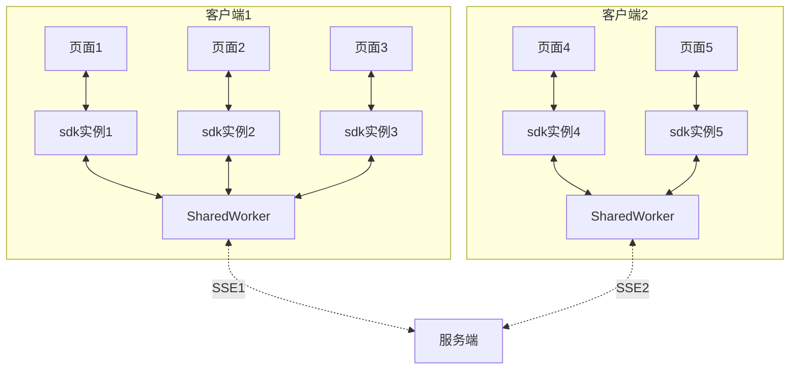
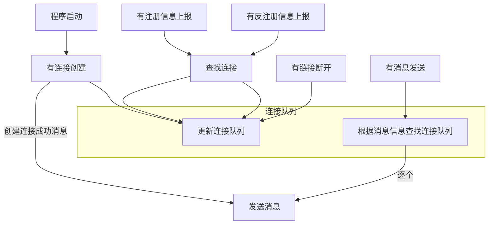
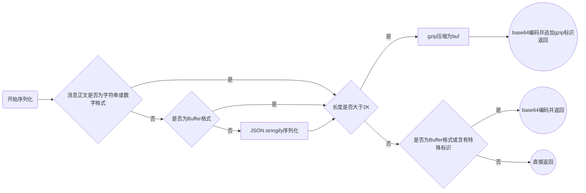
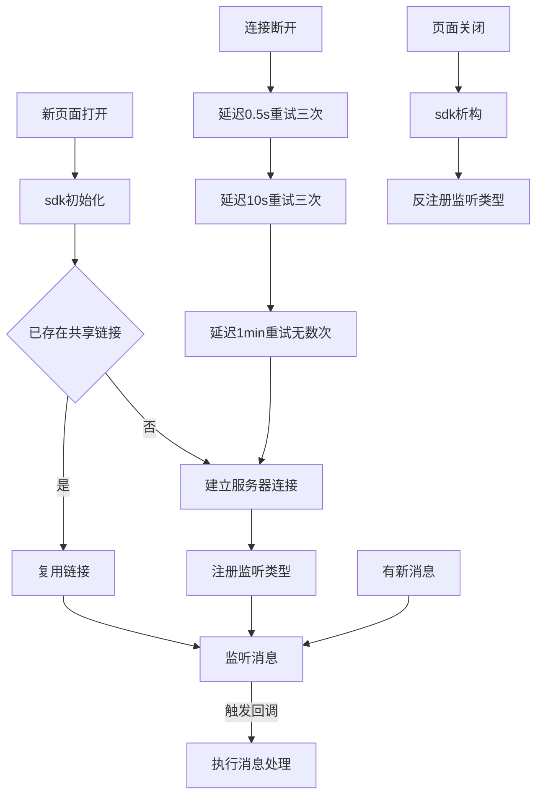

# 基于SSE的消息通知-服务端

## 目的
基于SSE通道, 实现简单的在线消息推送机制。实现消息类型注册，监听的单向数据推送。较Websocket或Socket.io方案更为简化。

由于时SSE方式的长连接，客户端使用SharedWorker方式解决浏览器端的并发限制问题。

## 设计思路

整体分为后端模块和前端sdk两部分。
客户端sdk初始化后, 向服务端上报要监听的数据范围(http+post请求); 监听成功后,服务端在生成对应消息时会将该消息返回给客户端,并触发msg事件;

### 后端模块
后端模块以connect/express中间件方式存在, 提供对路由的监听处理, 方便挂载路由和处理。

设计目标为单个客户端与服务器之间维护最多一个长连接, 该连接以SSE方式存在.

该连接在服务端维护, 当遇到需要向该客户端推送消息时(以clientId为识别客户端的唯一标识), 根据clientId找到对应SSE的socket, 向该socket发送消息,写入内容. 对于客户端, 该SSE在SharedWorker内创建, 以实现各个浏览器页面共享一份SSE连接的效果.




客户端使用样例如下：
```javascript
let ssemsg = require('ssemsg');
app.use('/msg', new SseMsg());
```



### 消息数据结构设计
```javascript
msg = `13位数字时间戳:文本格式的消息正文`
//举例: msg:1629807202667:{a:1,b:2} 或者
//举例: msg:1629807202667:base64:xxxxxxxx 
```
13位数字时间戳为精确到毫秒的时间戳, 通过Date.now()获取服务器时间得到

消息正文为序列化后的字符串, 如果是Object对象,则进行JSON.stringify处理后生成; 如果生成的数据长度大于2K或者如果含有特殊字符\n\n,则转base64后传输;
流程如下:



### 前端sdk
前端sdk以独立js脚本方式存在,使用方式如下:

```javascript
// <script src="ssemsg.min.js"></script>
let url = BASE_URL + '/msg';
let sseMsg = new SseMsg(url, clientId=null, pageId=uuid());

/**
 * 向服务器声明要监听的范围,
sseMsg.reg('监听范围',function(msg){ //监听的回调函数
  //do something with msg
});
*/
sseMsg.reg('event:*', callBack1);
sseMsg.reg('sse:room:*', callBack2);
sseMsg.reg('*', callBack3);

sseMsg.reg('broswer:*', callBack4); //注册浏览器内部各网页间的消息

sseMsg.reg('system:*', callBackDefault) //sdk会默认监听system:*类型的所有消息,无需业务层面处理,此函数在new完毕后自动执行
```





服务端单个消息仅对单个clientId投送一次;
单个客户端收到后给多个页面每个投送0~1次,共计0~N次;


客户端分为运行在页面内的sdk + 运行在SharedWorker的连接信息两部分, 

* SharedWorker部分仅负责建立连接/取消连接/处理连接异常/重连/转发消息到所有sdk
* sdk部分负责创建SharedWorker/向服务器注册/向服务端反注册/监听来自SharedWorker的消息/


## 其他降级方案

|  连接类型   | 用途  | 注意事项 | 应用场景 |
|  ----  | ----  | ---- | ---- |
| SSE  | 近实时 | 默认类型 | 默认使用, 推荐 |
| 直接关闭并立即重连的SSE  | 低延迟 | 发送并立即重连,模拟长轮询;可规避服务器缓存问题导致的下发受阻;一般重来你时间设置为10ms | 网络投送被缓存时使用|
| 直接关闭并延迟重连的SSE | 高延迟 | 有无消息均立即关闭, 重连时间固定为500ms, 容忍高延迟, 需确保消息最终到达 | 浏览器不支持SharedWorker或同一客户端异常发起多个连接时使用|

降级方案仍采用SSE, 完全由服务端通过控制retry时间和是否关闭连接来控制模拟成长轮询或短轮询.
长轮询 = 有消息时立即发送并关闭, retry:10
短轮询 = 有无消息均立即发送并关闭, retry:500

长轮询和短轮询两种降级方案均需要存在消息缓冲池, 设计上需要补充该机制.


```mermaid
graph TB
新消息产生 --> 加入消息缓冲池 --> 查找客户端 --> 投送消息 --> 为该客户端标记最后投递msgId
新连接建立 --得到clientId--> 查询该客户端msgId --> 到消息缓冲池查找消息 --> 投递消息

subgraph 消息查询机制
新消息事件 --> A[根据消息类型+客户端id+监听条件+]


```

### 多个连接的处理机制[降级为短轮询]
同一个客户端发起第二个SSE连接过来后, 上一个SSE连接立即结束, 避免多个连接出现的异常问题.
这样始终对同一个客户端最多拥有一个有效的SSE连接, 避免客户端连接数占满的问题.

由于断开的SSE连接会由客户端自动发起下一次连接尝试, 会继续将上一次的连接挤下, 这样实际效果就实现了一种互相竞争的短轮询效果.
retry的时间设置为: 500ms + (200ms*Math.random()), 即500ms ~ 700ms的延迟. 

### 消息压缩

由于SSE本质上位纯文本协议,不适合传输大量数据或二进制数据. 如果单条消息的长度大于2K,或者消息内容为二进制,则优先进行gzip压缩, 然后将压缩后的数据通过base64编码下发给客户端.


## 待处理
* [ ] 短轮询降级

## 规划中

